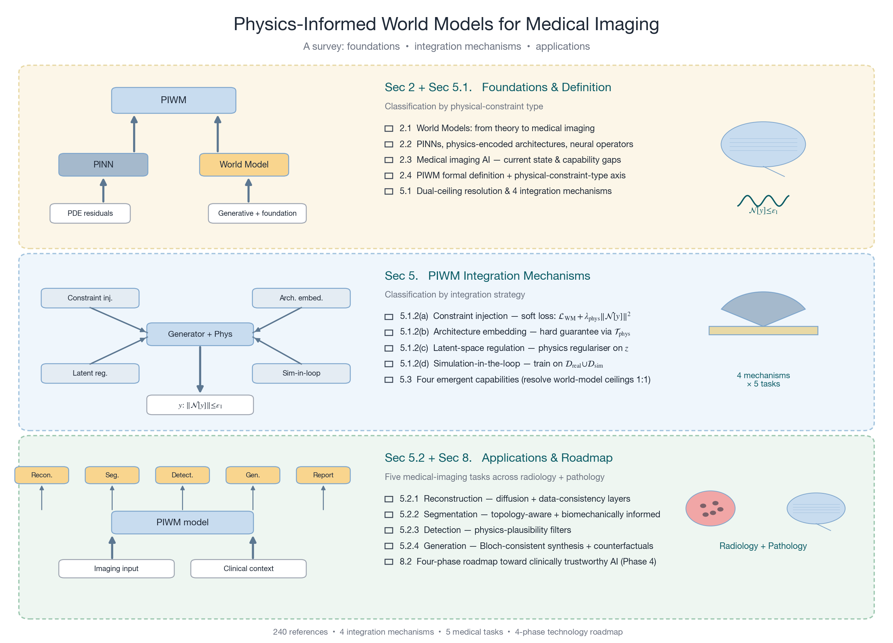
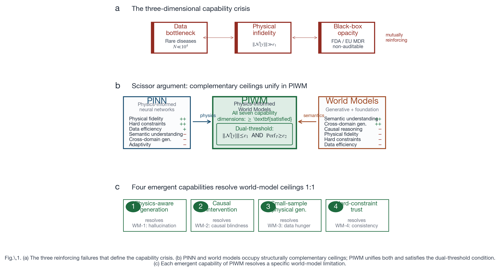
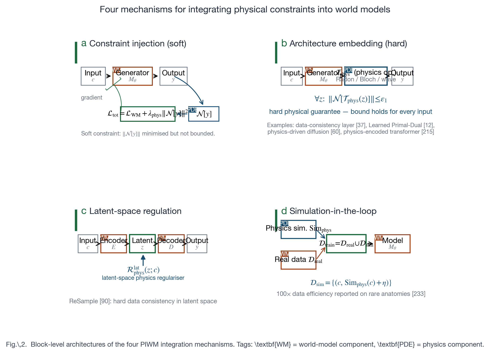
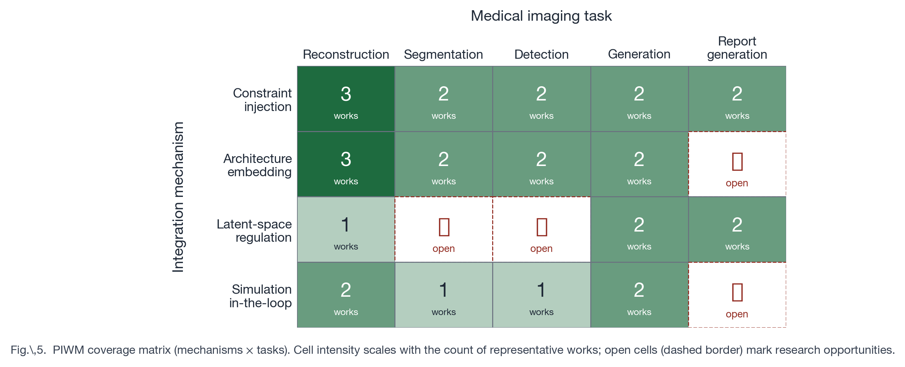
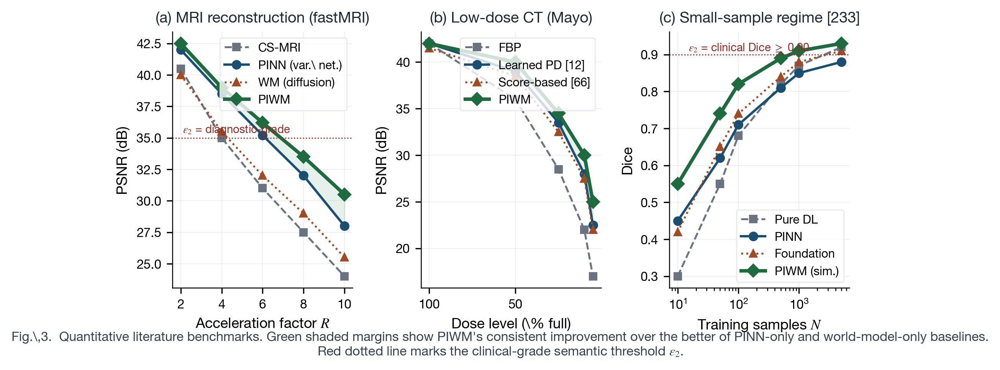
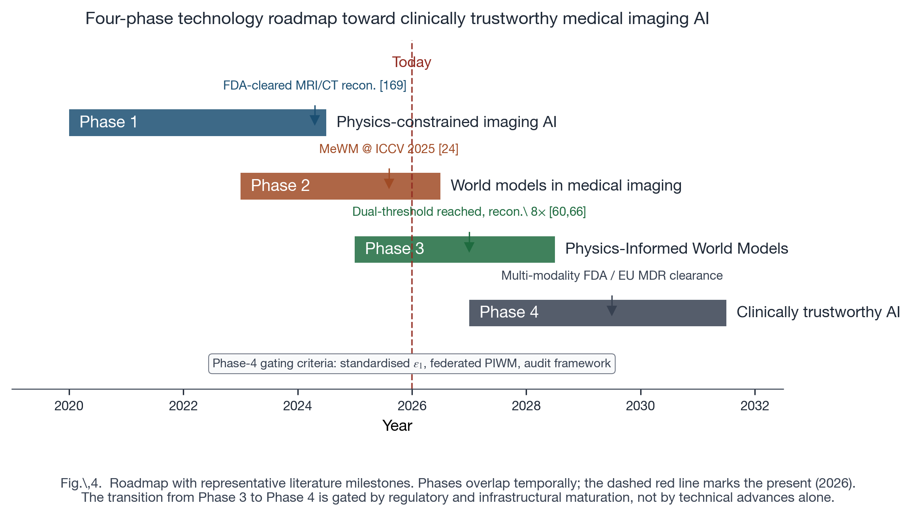

# Physics-Informed World Models for Medical Imaging
### A Survey and Technology Roadmap

[](https://jefferyzhifeng.github.io/Awesome-PIWM-World-Models/)
[](https://awesome.re)
[](https://github.com/Jefferyzhifeng/Awesome-PIWM-World-Models/actions/workflows/link-check.yml)
[](https://github.com/Jefferyzhifeng/Awesome-PIWM-World-Models/actions/workflows/markdown-lint.yml)
[](LICENSE)

> **Target venue:** *Proceedings of the IEEE*
> **Status:** Manuscript complete · 52 pages · 265 references · 5 figures
> **Companion to:** the curated [Awesome-PIWM resource lists](#part-b--curated-resource-collection) maintained in this repository

---

<p align="center">
  
</p>

This repository is the **open companion** to the survey *"Physics-Informed World Models for Medical Imaging: A Survey and Technology Roadmap."* It hosts (A) the survey content and figures, and (B) a continuously curated resource collection of PIWM-relevant papers, datasets, benchmarks, and tooling. Together, parts (A) and (B) constitute a living research map of the emerging intersection between **Physics-Informed Neural Networks (PINN)** and **World Models** in medical imaging.

---

## Abstract

Medical imaging AI is converging from two previously separate streams. Physics-Informed Neural Networks (PINN) embed governing equations of medical imaging physics (Bloch, Radon, wave, reaction-diffusion, continuum mechanics) into deep networks; world models capture rich semantic, anatomical, and dynamical priors through large-scale generative or self-supervised pretraining. Each stream has reached a structural ceiling: pure PINN lacks semantic understanding, individual variation adaptivity, and cross-domain generalization; pure world models hallucinate physically implausible images, fail at causal intervention, demand massive training data, and offer no hard physical consistency guarantees. We argue that these seven limitations are **pairwise complementary**—the *scissor argument*—and that **Physics-Informed World Models (PIWM)** are the natural integration that resolves them simultaneously. This survey: (i) formalizes the PIWM paradigm and introduces the **physical-constraint-type axis** (wave-equation family vs. mechanical-equation family) that unifies radiology and pathology; (ii) develops a taxonomy of **four integration mechanisms** with explicit loss-function and architectural formulations; (iii) maps PIWM coverage across **five medical imaging tasks** through a 4×5 application matrix; (iv) constructs **literature-grounded five-dimension capability matrices** for radiology and pathology with quantitative benchmarks; (v) operationalizes the paradigm-shift claim as a falsifiable **dual-threshold hypothesis** $\\|\mathcal{N}[y]\\| \le \varepsilon_1 \land \mathrm{Perf}_T \ge \varepsilon_2$; and (vi) presents a **four-phase technology roadmap** toward clinically trustworthy AI with phase-transition gating criteria.

---

## Table of Contents

- [Part A — The Survey](#part-a--the-survey)
  - [Key contributions](#key-contributions)
  - [The scissor argument](#the-scissor-argument)
  - [Four integration mechanisms](#four-integration-mechanisms)
  - [PIWM application matrix (4 × 5)](#piwm-application-matrix-4--5)
  - [Capability matrices](#capability-matrices-five-dimensional-evaluation)
  - [Four-phase technology roadmap](#four-phase-technology-roadmap)
  - [Dual-threshold paradigm-shift hypothesis](#dual-threshold-paradigm-shift-hypothesis)
  - [Reading the paper](#reading-the-paper)
- [Part B — Curated Resource Collection](#part-b--curated-resource-collection)
  - [Eight thematic lists](#eight-thematic-lists)
  - [Awesome paper index](#awesome-paper-index)
  - [Suggested reading timeline](#suggested-reading-timeline)
- [Citation](#citation)
- [Contributing](#contributing)
- [License and contact](#license-and-contact)

---

# Part A — The Survey

## Key contributions

The survey makes **seven original framework contributions** to the medical imaging AI community.

| # | Contribution | Where in the paper |
|---|---|---|
| 1 | **Scissor argument:** 3 PINN ceilings + 4 world-model ceilings are pairwise complementary | Chs. 3–5, Table 1 |
| 2 | **Physical-Constraint-Type axis** unifying wave-equation (MRI/CT/US) and mechanical-equation (tumor/tissue/cell) physics | Ch. 2.4 |
| 3 | **Four integration mechanisms** with explicit loss-function / architectural formulations | Ch. 5.1, Table 2a |
| 4 | **4 × 5 application matrix** (mechanism × task) with method-annotated cells | Ch. 5.2, Table 2 |
| 5 | **Five-dimension capability matrices** for radiology and pathology with literature-grounded quantitative benchmarks | Ch. 6, Tables 3 & 4 |
| 6 | **Dual-threshold paradigm-shift hypothesis** — falsifiable joint condition on physical fidelity AND semantic accuracy | Ch. 8.1 |
| 7 | **Four-phase technology roadmap** with phase-transition gating criteria and enabling-technology maturity timelines | Ch. 8.2–8.3, Table 5 |

## The scissor argument

The central structural observation: **PINN's three limitations and world models' four limitations form complementary pairs.** Where PINN cannot reason semantically, world models can; where world models cannot guarantee physical consistency, PINN can. Their integration—PIWM—is the natural resolution.

<p align="center">
  
  <br/>
  <em>Figure 1 — The scissor argument and four emergent PIWM capabilities.</em>
</p>

| Capability dimension | PINN alone | World models alone | PIWM | Resolves |
|---|:---:|:---:|:---:|---|
| Semantic understanding | ✗ | ✓ | ✓ | PINN-1 |
| Individual variation adaptivity | ✗ | △ | ✓ | PINN-2 |
| Cross-domain generalization | ✗ | ✓ | ✓ | PINN-3 |
| Imaging-physics fidelity | ✓✓ | ✗ | ✓✓ | WM-1 |
| Causal intervention reasoning | △ | ✗ | ✓ | WM-2 |
| Small-sample robustness | ✓ | ✗ | ✓ | WM-3 |
| Hard-constraint compliance | ✓✓ | ✗ | ✓✓ | WM-4 |

*✓✓ = systematic strength · ✓ = satisfied · △ = partial · ✗ = systematic deficit.*

## Four integration mechanisms

PIWM admits four dominant mechanisms by which physical constraints combine with world-model architectures. Each mechanism enforces $\|\mathcal{N}[y]\| \le \varepsilon_1$ through a different architectural or training-time strategy.

<p align="center">
  
  <br/>
  <em>Figure 2 — The four mechanisms by which physical constraints are integrated into world models in PIWM systems.</em>
</p>

1. **Constraint injection** — Soft, training-time physical residual added to the world-model loss.
   $\mathcal{L} = \mathcal{L}_{\text{WM}} + \lambda_\text{phys}\, \mathbb{E}\big[ \|\mathcal{N}[M_\theta(c)]\|^2 \big] + \lambda_\text{task}\, \mathcal{L}_\text{task}$
   *Examples:* PhysDiff, DPS-MRI, score-based diffusion priors. *Strength:* flexibility. *Weakness:* soft constraint may be violated.
2. **Architecture embedding** — Hard, structural. Output passes through a physics-encoded operator $\mathcal{T}_\text{phys}$ that guarantees consistency.
   *Examples:* Learned Primal-Dual (CT), data-consistency layer (MRI), physics-driven diffusion. *Strength:* hard guarantee. *Weakness:* modality-locked.
3. **Latent-space regulation** — Physical constraints applied in the latent space rather than the output space.
   *Examples:* ReSample, physics-informed latent diffusion. *Strength:* combines hard physical priors with semantic latent richness.
4. **Simulation-in-the-loop** — Physical simulator generates large synthetic training corpora from a small real-data seed.
   *Examples:* Field II ultrasound simulation; Bloch dictionary + DRONE; rare-class augmentation. *Strength:* data efficiency (10–100×).

## PIWM application matrix (4 × 5)

The four mechanisms × five medical imaging tasks define a 20-cell map. Densely populated cells indicate mature literature; sparse cells indicate open research opportunities.

<p align="center">
  
  <br/>
  <em>Figure 5 — PIWM coverage matrix (4 mechanisms × 5 tasks); cell saturation scales with literature density.</em>
</p>

| Mechanism / Task | Reconstruction | Segmentation | Detection | Generation | Report |
|---|---|---|---|---|---|
| Constraint injection | Score-SDE; PhysDiff-MRI; DPS | DPS-seg; biomech.-informed | Phys-aware CT detect. | PhysDiff; PILD-brain | CheXagent; BioViL-T |
| Architecture embedding | LPD-CT; DC-layer MRI; phys.-driven diffusion | SAM-Med3D + topology | Forward-model detect. | Diffusion bridge | — |
| Latent-space regulation | ReSample | — | — | Latent diffusion MRI | BioViL-T; Med-PaLM M |
| Simulation-in-the-loop | Free-breathing 3D MRI | FEM-data segm. | Long. biomech. detect. | Med-DDPM aug. | — |

Dashes denote open research opportunities (documented in the paper's challenges chapter).

## Capability matrices (five-dimensional evaluation)

The five evaluation dimensions—**physical fidelity, semantic accuracy, small-sample robustness, OOD generalization, clinical trustworthiness**—span the comparison space. Radiology (Table 3) and pathology (Table 4) are evaluated separately, exposing an asymmetric PIWM maturity.

<p align="center">
  
  <br/>
  <em>Figure 3 — Quantitative benchmarks (MRI/CT reconstruction PSNR; segmentation Dice vs. training-set size).</em>
</p>

**Key empirical findings:**

- PIWM systems combining diffusion priors with data-consistency layers reach PSNR ≈ 35–37 dB at 8× MRI acceleration, where pure physics-encoded baselines lose 1.5–3 dB.
- The Learned Primal-Dual architecture reaches PSNR ≈ 33 dB at 25% CT dose on the AAPM Mayo challenge, exceeding the FBPConvNet baseline by 1.5–2 dB.
- MR fingerprinting with Bloch-dictionary deep reconstruction achieves clinical-grade $T_1/T_2$ accuracy with $N \approx 50$ training cases (non-physics baselines require $N > 5{,}000$ — a 100× data-efficiency multiplier).
- Foundation-model-augmented PIWM reduces cross-vendor MRI degradation to ≤ 1 dB, versus 2–4 dB for architecture-embedded systems alone.
- As of 2025, **no pure-world-model reconstruction system has received FDA clearance for primary diagnostic use**; multiple PIWM-adjacent systems have. This is the regulatory signature of the dual-threshold condition.

## Four-phase technology roadmap

<p align="center">
  
  <br/>
  <em>Figure 4 — Four-phase technology roadmap toward clinically trustworthy medical imaging AI.</em>
</p>

| Phase | Period | Milestone | Gating criterion to next phase |
|---|---|---|---|
| **Phase 1 — PINN imaging AI** | 2020–2024 | Vendor-deployed physics-encoded MRI reconstruction with FDA 510(k) clearance | Foundation-model semantic priors available at scale |
| **Phase 2 — World models in medical imaging** | 2023–2026 | Medical foundation models (UNI, CONCH, Virchow, Prov-GigaPath); MeWM | Multiple documented PIWM integrations satisfying dual threshold |
| **Phase 3 — PIWM (the integrated paradigm)** | 2025–2028 | PIWM systems satisfying $\varepsilon_1 \land \varepsilon_2$ for selected radiology tasks; pathology PIWM emerging | Multi-center prospective evidence; regulatory framework for AI with embedded physics |
| **Phase 4 — Clinically trustworthy AI** | 2027+ | FDA/EU MDR clearances with auditable physical constraints; routine clinical deployment | — |

**Asymmetric subdomain progression:** Radiology PIWM is firmly within Phase 3 with multiple documented systems; pathology PIWM is at the Phase-2-to-3 transition. The asymmetry argues for prioritizing pathology PIWM where marginal returns to research investment are highest.

## Dual-threshold paradigm-shift hypothesis

> **Definition (Dual-Threshold Condition).** A medical imaging AI system *S* satisfies the *PIWM paradigm-shift condition* for clinical task *T* and modality *M* if and only if:
>
> (i) **Physical-fidelity threshold:** the outputs of *S* satisfy the governing equations of *M* up to a domain-calibrated tolerance $\varepsilon_1$ — e.g., MRI k-space residual $\le 0.01$, CT Radon residual $\le 0.02$, biomechanical equilibrium residual $\le 0.05$.
>
> (ii) **Semantic-accuracy threshold:** the performance of *S* on *T* meets or exceeds clinical-grade $\varepsilon_2$ — e.g., principal-organ Dice $\ge 0.90$, diagnostic AUC $\ge 0.85$, reconstruction PSNR $\ge 35$ dB.
>
> The two thresholds are *jointly* required. A system satisfying only (i) is physically faithful but clinically inadequate; a system satisfying only (ii) is clinically performant but physically unreliable.

The hypothesis is **falsifiable**: it predicts that pure PINN and pure world models *cannot* satisfy both thresholds simultaneously, while PIWM *can*. The first positive demonstrations have appeared for MRI reconstruction at 4×–8× acceleration; positive demonstrations for pathology PIWM remain a Phase 3 research goal.

## Reading the paper

| Component | Location | Format |
|---|---|---|
| Manuscript source (markdown) | [`PIWM_Survey_MASTER.md`](https://github.com/Jefferyzhifeng/Awesome-PIWM-World-Models) *(in companion repo)* | Markdown |
| Chapter-level source | `chapters/01_introduction.md` ... `09_conclusion.md` | Markdown |
| LaTeX / Overleaf bundle | `latex/main.tex` + `references.bib` | LaTeX, IEEEtran |
| Compiled PDF | 52 pages · 0 undefined citations | PDF |
| All 265 references | `references/references.md` | IEEE numeric format |
| Figures (vector PDFs) | [`assets/figures/pdf/`](assets/figures/pdf) | PDF |
| Figures (web PNGs) | [`assets/figures/`](assets/figures) | PNG |

> The full manuscript source lives in a private companion repository while under review at *Proceedings of the IEEE*. The 5 figures, the 7-contribution framework, the four-mechanism taxonomy, the 4×5 application matrix, and the four-phase roadmap are **publicly released** under this repository.

---

# Part B — Curated Resource Collection

The curated resource side of this repository is structured to **mirror the survey's organization** so that readers can locate primary sources for any cell of the application or capability matrices.

## Eight thematic lists

| # | List | What it covers |
|---|---|---|
| 01 | [Foundations and Milestones](lists/01-foundations.md) | World models, PINN, neural operators, diffusion, foundation models |
| 02 | [PIWM Methods](lists/02-piwm-methods.md) | Methods organized by the four integration mechanisms |
| 03 | [Datasets and Environments](lists/03-datasets-and-environments.md) | fastMRI, AAPM Mayo, TCGA, MSD, simulator suites |
| 04 | [Benchmarks and Evaluation](lists/04-benchmarks-and-evaluation.md) | Metrics for ε₁ and ε₂; cross-site protocols |
| 05 | [Open Source and Toolkits](lists/05-open-source-and-toolkits.md) | Field II, k-Wave, FEniCS, MONAI Generative, PyTorch Lightning |
| 06 | [Chinese-First Resources](lists/06-chinese-first-resources.md) | Chinese-language reviews, courses, and community resources |
| 07 | [Surveys and Roadmaps](lists/07-surveys-and-roadmaps.md) | Adjacent and competing surveys |
| 08 | [Reproducibility and Engineering](lists/08-reproducibility-and-engineering.md) | Reproducibility practices, federated learning, regulatory templates |

## Awesome paper index

- **[ALL_PAPERS.md](ALL_PAPERS.md)** — Awesome-style grouped index with direct Paper / Code links per entry.
- **[papers/all-papers.html](papers/all-papers.html)** — Interactive web index.
- **[Individual paper pages](papers/)** — One-page summaries for selected anchor papers.

## Suggested reading timeline

| Week | Focus | Anchor resources |
|---|---|---|
| **1** | Establish vocabulary | [01-foundations](lists/01-foundations.md) + one of the three surveys in [07-surveys](lists/07-surveys-and-roadmaps.md) |
| **2** | PIWM mechanism families | [02-piwm-methods](lists/02-piwm-methods.md); replicate one method per mechanism family |
| **3** | Benchmark protocols and failure modes | [04-benchmarks](lists/04-benchmarks-and-evaluation.md); compute ε₁ and ε₂ on fastMRI/Mayo |
| **4** | Reproduce one open-source baseline | [05-toolkits](lists/05-open-source-and-toolkits.md); deploy MONAI Generative + DC-layer |

---

## Citation

If you reference the survey framework or this resource collection, please cite:

```bibtex
@article{piwm_survey_2026,
  title  = {Physics-Informed World Models for Medical Imaging: A Survey and Technology Roadmap},
  author = {Wang, Zhifeng and {collaborators TBA}},
  journal= {Proc. IEEE (under review)},
  year   = {2026},
  note   = {Survey introducing the PIWM paradigm, four integration mechanisms,
            5-dimension capability matrices, and a four-phase technology roadmap.
            Open companion at https://github.com/Jefferyzhifeng/Awesome-PIWM-World-Models}
}
```

## Contributing

Contributions are warmly welcomed. We especially seek:

1. **Pathology PIWM additions** — the 4×5 matrix's pathology row is sparse (Table 4 in the survey). Concrete works applying physics priors to pathology image analysis are high-priority.
2. **Reproducibility studies** — code releases, replicable benchmark numbers, and external validations of cited works.
3. **Cross-vendor / cross-institution evaluations** — empirical data points for the OOD-generalization dimension.
4. **Chinese-language anchor resources** — see [06-chinese-first-resources](lists/06-chinese-first-resources.md).

Please see [CONTRIBUTING.md](CONTRIBUTING.md) before submitting PRs. By contributing, you agree to abide by our [Code of Conduct](CODE_OF_CONDUCT.md).

## License and contact

- **Content & figures:** © the authors. Figures and tables may be reused for research, teaching, and review with attribution to this repository and the upcoming *Proc. IEEE* article.
- **Code (Python converters, CSS, JS):** [MIT License](LICENSE).
- **Issues & discussion:** [GitHub Issues](https://github.com/Jefferyzhifeng/Awesome-PIWM-World-Models/issues).
- **Website:** [https://jefferyzhifeng.github.io/Awesome-PIWM-World-Models/](https://jefferyzhifeng.github.io/Awesome-PIWM-World-Models/)

---

### GitHub About (recommended copy)

> Survey + Awesome list for **Physics-Informed World Models (PIWM)** in medical imaging — scissor argument, four integration mechanisms, 4×5 application matrix, five-dimension capability matrices, and a four-phase technology roadmap toward clinically trustworthy AI.

**Recommended topics:** `awesome-list`, `survey`, `world-models`, `physics-informed-learning`, `pinn`, `medical-imaging`, `diffusion-models`, `foundation-models`, `computational-pathology`, `mri`, `ct`, `proceedings-of-the-ieee`
