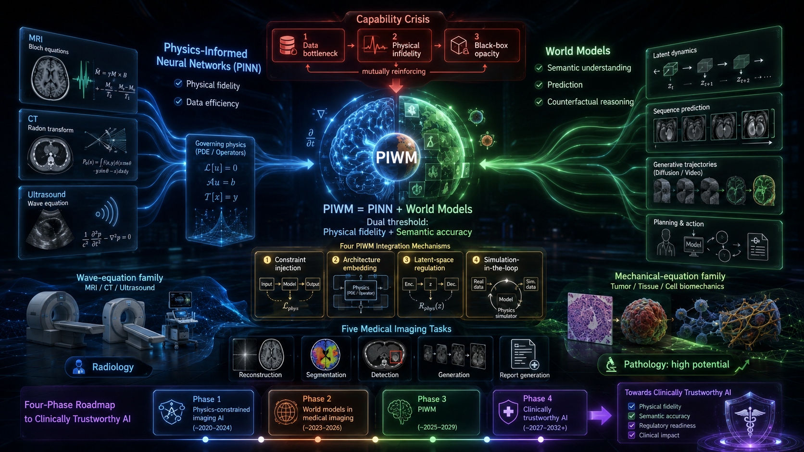

# Physics-Informed World Models for Medical Imaging 

A curated list of **Physics-Informed World Models (PIWM)** and broader **World Models** for medical imaging research and engineering.

## Table of Contents

- [Quick Start](#quick-start)
- [Curated Lists](#curated-lists)
- [All Papers Collection](#all-papers-collection)
- [Contributing](#contributing)
- [Project Info](#project-info)

## Quick Start

### For researchers
1. Start with [Foundations](lists/01-foundations.md)
2. Read [Surveys and Roadmaps](lists/07-surveys-and-roadmaps.md)
3. Compare [PIWM Methods](lists/02-piwm-methods.md)

### For engineers
1. Start with [Open Source and Toolkits](lists/05-open-source-and-toolkits.md)
2. Use [Datasets and Environments](lists/03-datasets-and-environments.md)
3. Follow [Reproducibility and Engineering](lists/08-reproducibility-and-engineering.md)

## Curated Lists

### 📰 News & Updates

1. **Repository Updates**
   - [Changelog](CHANGELOG.md)
   - [GitHub Pages deployment notes](docs/GITHUB_PAGES.md)

2. **Project Navigation**
   - [Homepage](index.html)
   - [Lists Index (searchable)](lists/index.html)
   - [Paper Pages (interactive)](papers/all-papers.html)

### 🧭 Overview

1. **Foundational Landscape**
   - [01 Foundations and Milestones](lists/01-foundations.md)
   - [Papers by Topic (Paper + Code)](ALL_PAPERS.md)

2. **Method Taxonomy**
   - [02 PIWM Methods](lists/02-piwm-methods.md)
   - [04 Benchmarks and Evaluation](lists/04-benchmarks-and-evaluation.md)

3. **Resources and Ecosystem**
   - [03 Datasets and Environments](lists/03-datasets-and-environments.md)
   - [05 Open Source and Toolkits](lists/05-open-source-and-toolkits.md)

4. **Practice and Governance**
   - [08 Reproducibility and Engineering](lists/08-reproducibility-and-engineering.md)
   - [CONTRIBUTING](CONTRIBUTING.md)

### 📚 Surveys of World Models

1. **Core Medical Surveys**
   - [PINN for Medical Image Analysis: A Systematic Review (2025)](https://doi.org/10.1145/3768158)
   - [Physics-Informed ML for Computational Medical Imaging (2025)](https://doi.org/10.1007/s10462-025-11303-w)
   - [Physics-Inspired Generative Models in Medical Imaging (2025)](https://doi.org/10.1146/annurev-bioeng-102723-013922)

2. **Trustworthiness and Capability Gap**
   - [Physical Foundations for Trustworthy Medical Imaging AI (2025)](https://arxiv.org/abs/2505.02843)
   - [Computational Histopathology Survey (2021)](https://doi.org/10.1016/j.media.2020.101813)

3. **General World-Model References**
   - [DreamerV3 (2023)](https://arxiv.org/abs/2301.04104)
   - [A Path Towards Autonomous Machine Intelligence (2022)](https://openreview.net/forum?id=BZ5a1r-kVsf)

4. **Complete Survey List**
   - [07 Surveys and Roadmaps](lists/07-surveys-and-roadmaps.md)
   - [Paper portal by topic](papers/all-papers.html)

## All Papers Collection

- Full index: [ALL_PAPERS.md](ALL_PAPERS.md)
- Internal paper pages: [papers/all-papers.html](papers/all-papers.html)
- Foundations focus: [01-foundations.md](lists/01-foundations.md)
- Methods focus: [02-piwm-methods.md](lists/02-piwm-methods.md)
- Surveys focus: [07-surveys-and-roadmaps.md](lists/07-surveys-and-roadmaps.md)

## Contributing

Please read [CONTRIBUTING.md](CONTRIBUTING.md) before submitting PRs.

## Project Info

- Homepage: [GitHub Pages](https://jefferyzhifeng.github.io/Awesome-PIWM-World-Models/)
- Changelog: [CHANGELOG.md](CHANGELOG.md)
- Pages setup: [docs/GITHUB_PAGES.md](docs/GITHUB_PAGES.md)
- License: [MIT](LICENSE)

## GitHub About (recommended)

`Curated Awesome list for Physics-Informed World Models (PIWM) and World Models in medical imaging, featuring papers, benchmarks, toolkits, datasets, and reproducible engineering workflows.`

Recommended topics:
`awesome-list`, `world-models`, `physics-informed-learning`, `pinn`, `medical-imaging`, `diffusion-models`, `foundation-models`, `computational-pathology`, `mri`, `ct`
